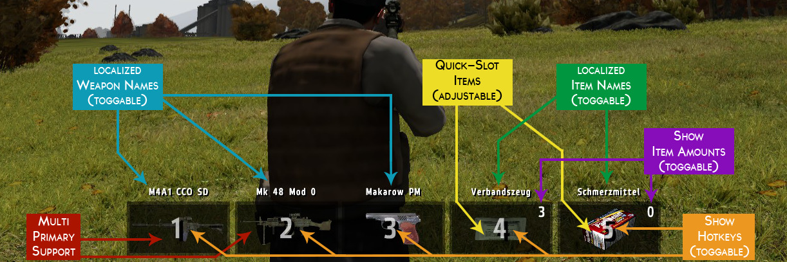

# RLNT Weapon HUD
**DayZ-Epoch 1.0.6.2**<br>
*Last update: 23.04.2018* | *v1.3.0*<br>

---

[Epoch-Forum][epoch]<br>
[Bug report][bugs]<br>
[Feature request][requests]<br>

[Releases][releases]

---

## Credits

+ **Authors:**
	+ **Relentless:** [GitHub][relentless]
	+ **Thonikum:** [GitHub][thonikum]
+ **$p4rkY:** taught me most in SQF ([his GitHub][sparky])
+ **Salival:** always helping me with brainf*cking issues ([his GitHub][salival])
+ **Iben:** often helps with issues, also got the GitHub design from him ([his GitHub][iben])
+ **LordGolias:** made an awesome Atom SQF-linter ([his GitHub][golias])
+ **Epoch-Discord:** filled with nice guys that often help ([join the Discord][discord])

+ **Bug Reporters:**
	+ **kingpapawawa:** active tester and bug reporter
	+ **WLF:** reported weapon and item names bug
+ **Requesters:**
	+ **BigEgg:** requested old weapon hud style
	+ **gelo534:** requested resizable weapon hud

---

## Structure

- [Features](#features)
	- [text](#text)
	- [picture](#picture)
- [Install instructions](#installation)
	- [fresh installation][fresh]
	- [custom installation][custom]
- [Configuration](#config)
	- [general](#general)
	- [custom weapons](#weapons)
	- [custom items](#items)
	- [togglable Weapon HUD](#toggle)
- [Changelog](#changelog)

---

<a name="features"></a>
## Features

<a name="text"></a>
- General:
	- Multi-Weapon-Support (compatible with one or two primaries)
	- Quick-Items (adjustable item type and amount)
- Visibles (toggable in config):
	- hotkeys
	- weapon names (localized)
	- item names (localized)
	- item amounts
- Customizables (adjustable in config):
	- hotkeys
	- item type
	- item amount
	- colors of the boxes
	- colors of the texts
	- colors of the hotkeys
- Other:
	- The script includes a huge error prevention mechanic. Whenever it will detect an error in your installation or in your configuration, it will either automatically fix it or inform you.
	- It also detects the amount of boxes that are needed to display everything you set up.
	- The Weapon HUD has a huge config you can adjust to fit your personal preferences. Everything you need to know is explained in there.
	- It also supports custom weapons and items.
	- Since v1.2.0 you are able to adjust the size of the whole display and to use key combos!
	- Since v1.3.0 you are able to adjust the offset of the display (moving left or right)!

<a name="picture"></a>
**That's not enough explanation for you and you want some graphical information? Here you go:**


<br>
If you don't like the hotkey displaying method, it could also look like this:
<br>


---

<a name="installation"></a>
## Install instructions

If you don't have any RLNT scripts use the [fresh instructions][fresh].<br>
If you already have any RLNT scripts installed use [custom instructions][custom].

---

<a name="config"></a>
## Configuration

<a name="general"></a>
**General configuration:**
<br>
All you need to do is opening "mission/rlnt/addons/Weapon HUD/rlnt_wh_config.sqf". Basically, you have to read everything that is explained in there and adjust the options to your personal preferences. You can also keep everything default if you are too lazy or don't know what to do, the configuration should be fine.

<a name="weapons"></a>
**Custom weapons:**
<br>
As I said in the features, this script also supports custom weapons. All Epoch weapons are added by default but if you use Overpoch (which includes the Overwatch weapons), you might need to adjust the configuration. It's not like you have to add all weapons to the script. That would be horrible. But if you take a look into the config, you should see an option that is called 'rlnt_wh_smallWeapons'. As the description of the option says, you have to insert all weapons that are smaller than the usual assault rifles. Everything like pistols. Otherwise the images will be stretched and ugly. If you don't add them to the array they will still be supported but as I said, the image will look ugly.

<a name="items"></a>
**Custom items:**
<br>
Same as the weapons, custom items are also supported but a bit more complicated to add. Currently, you can see all supported items in the config in the 'rlnt_wh_itemList'. I removed the case-sensitivity but if you want to add more items, you should include them case-sensitive to prevent further errors (just in case). Adding the item to the array is 100% required to make it supported! But that's not all you need to do. As you may have already seen, there are scripts for each item in the "mission/rlnt/addons/Weapon HUD/actions" folder. Whenever you add a new item, you need to write a script for it to tell the addon what should happen if you press the hotkey for it. Also you have to add it to the action-selection method which you can take a look at in "rlnt/functions/RLNT_wh_action.sqf". If you have any issues with that, let me know!

<a name="toggle"></a>
**Toggable Weapon HUD:**
<br>
Since so many people requested a toggle option in my last version, I finally decided to add it. Usually, you are only able to toggle it by pressing the configured hotkey. But I know there are people who want to add the toggle option into their dialogs or other menus. Good news, I made a function to do that. Whenever you want to toggle the Weapon HUD, execute the following line:
```sqf
call RLNT_wh_toggleHUD;
```
The function automatically detects whether the Weapon HUD is activated or deactived and will toggle it so if you want to reenable it, just use the same line again. Easy, isn't it?

---

<a name="changelog"></a>
## Changelog

| Date | Version | Description |
| :--- | :--- | :--- |
| 21.01.2018 | v1.0.0 | - Initial release |
| 21.01.2018 | v1.0.1 | - Updated references |
| 21.01.2018 | v1.0.2 | - Updated formatting |
| 21.01.2018 | v1.0.3 | - Fixed stringable<br>*Changes: [af9338c][update1]* |
| 21.01.2018 | v1.0.4 | - Fixed undefined error variable<br>*Changes: [3bf67d][update2]* |
| 21.01.2018 | v1.1.0 | - Fixed item notifications, error spam, localization<br>- Localized missing strings<br>*Changes: [e3e105][update3] [7e8168][update4] [eec26a][update5] [71fab4][update6]* |
| 22.01.2018 | v1.1.1 | - Fixed weapon and item names<br>*Changes: [c3c980][update7]* |
| 24.01.2018 | v1.1.2 | - Fixed bloodbag action<br>*Changes: [8f9683][update8]* |
| 26.01.2018 | v1.1.3 | - Added key combo support<br>*Changes: [3dda2f][update9]* |
| 07.02.2018 | v1.2.0 | - Added resizable display<br>- Fixed handgun being not removed when dropped<br>- Reworked Stringtable<br>- Improved error prevention system<br>*Changes: [962b37][update10] [8abf4d][update11] [06fb8b][update12] [0db7f3][update13]* |
| 16.02.2018 | v1.2.1 | - Added old hotkey displaying style<br>*Changes: [23e04b][update14]* |
| 01.03.2018 | v1.2.2 | - Added offset macro<br>*Changes: [3a8023][update15]* |
| 10.03.2018 | v1.2.3 | - Added removable double background<br>- Minor adjustments<br>*Changes: [2af4c2][update16] [e7e5c1][update17]* |
| 23.04.2018 | v1.3.0 | - Reworked install instructions<br>- Added multiple zips for easier installation<br>*Changes: [][update18]* |


<!-- Links  -->
[epoch]: https://epochmod.com/forum/topic/44851-uploading-rlnt-weapon-hud-21012018-v100 "Go to source"
[bugs]: https://github.com/RLNT/RLNT_WeaponHUD/issues/new "Go to source"
[requests]: https://epochmod.com/forum/topic/44851-uploading-rlnt-weapon-hud-21012018-v100 "Go to source"
[releases]: https://github.com/RLNT/RLNT_WeaponHUD/releases "Go to source"
[relentless]: https://github.com/DAmNRelentless "Go to source"
[thonikum]: https://github.com/Thonikum "Go to source"
[sparky]: https://github.com/SPKcoding "Go to source"
[salival]: https://github.com/oiad "Go to source"
[iben]: https://github.com/infobeny "Go to source"
[golias]: https://github.com/LordGolias "Go to source"
[discord]: https://discord.gg/0k4ynDDCsnMzkxk7 "Go to source"
[fresh]: https://github.com/RLNT/RLNT_WeaponHUD/blob/master/installation/fresh.md "Go to source"
[custom]: https://github.com/RLNT/RLNT_WeaponHUD/blob/master/installation/custom.md "Go to source"
[freshclient]: https://github.com/RLNT/RLNT_WeaponHUD/blob/master/installation/fresh.md#client "Go to source"
[freshinfistar]: https://github.com/RLNT/RLNT_WeaponHUD/blob/master/installation/fresh.md#infistar "Go to source"
[customclient]: https://github.com/RLNT/RLNT_WeaponHUD/blob/master/installation/custom.md#client "Go to source"
[custominfistar]: https://github.com/RLNT/RLNT_WeaponHUD/blob/master/installation/custom.md#infistar "Go to source"
[update1]: https://github.com/RLNT/RLNT_WeaponHUD/commit/af9338ca96fcc5990ea0907894537ed8f4b95fea "Go to source"
[update2]: https://github.com/RLNT/RLNT_WeaponHUD/commit/3bf67dcf27880d87b826748698485e14dc945618 "Go to source"
[update3]: https://github.com/RLNT/RLNT_WeaponHUD/commit/e3e10568ccf6e4e41b97e5191f1fa12703b98e34 "Go to source"
[update4]: https://github.com/RLNT/RLNT_WeaponHUD/commit/7e816888972df33bee799a9b5650a9e39741340f "Go to source"
[update5]: https://github.com/RLNT/RLNT_WeaponHUD/commit/eec26ab46e73527c5ffa2919f056e57fa214f5fb "Go to source"
[update6]: https://github.com/RLNT/RLNT_WeaponHUD/commit/71fab4ac76ec20eed18b95896ece3b1fbf0150dd "Go to source"
[update7]: https://github.com/RLNT/RLNT_WeaponHUD/commit/c3c980ba60a577551f8f7eff00a6137088b0dc77 "Go to source"
[update8]: https://github.com/RLNT/RLNT_WeaponHUD/commit/8f96831c81578d8c6ba10265de63e70735664477 "Go to source"
[update9]: https://github.com/RLNT/RLNT_WeaponHUD/commit/3dda2f7594c3f2563e0c121ddbcc920d8ff83b9f "Go to source"
[update10]: https://github.com/RLNT/RLNT_WeaponHUD/commit/962b373d6caa764b225733c61d73390c9e1c61ea "Go to source"
[update11]: https://github.com/RLNT/RLNT_WeaponHUD/commit/8abf4d6ea0d66ac545d4190dcf8d961e51ab7728 "Go to source"
[update12]: https://github.com/RLNT/RLNT_WeaponHUD/commit/06fb8b7a607549c3d6def83d26f41d0bb74ce0b8 "Go to source"
[update13]: https://github.com/RLNT/RLNT_WeaponHUD/commit/0db7f326fe089a3ae6d74d6b2e2723ca58ebad67 "Go to source"
[update14]: https://github.com/RLNT/RLNT_WeaponHUD/commit/23e04b5750ea2bdc4dfea85bcce1509c809c14ee "Go to source"
[update15]: https://github.com/RLNT/RLNT_WeaponHUD/commit/3a8023c925793014e0c4827ed62018d9bacc9715 "Go to source"
[update16]: https://github.com/RLNT/RLNT_WeaponHUD/commit/2af4c2ff721dfac8de57976702471d8cf563ac33 "Go to source"
[update17]: https://github.com/RLNT/RLNT_WeaponHUD/commit/e7e5c144195b4d0a7e7b0053eff315e0498c8ed1 "Go to source"
